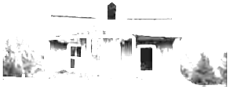
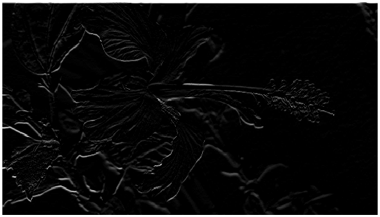
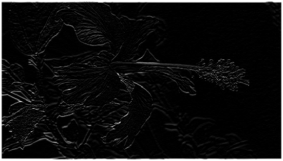
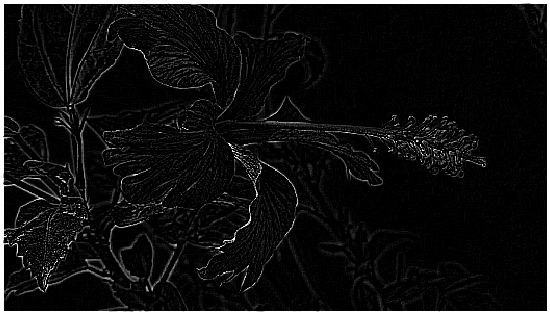
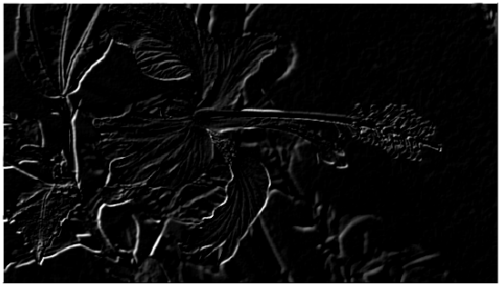

---

# Sharpening filter Examples

### Example 1 : brighten image 
filter = ones(3,3) 

<table>
  <tr>
    <td></td>
    <td></td>
  </tr>
</table>

### Example 2 : identeity 
filter = [0 0 0; 0 1 0; 0 0 0]

<table>
  <tr>
    <td></td>
    <td></td>
  </tr>
</table>

### Example 3 : Slight Blur
filter = 1/13*[0 0 1 0 0; 0 1 1 1 0; 1 1 1 1 1; 0 1 1 1 0; 0 0 1 0 0]

<table>
  <tr>
    <td></td>
    <td></td>
  </tr>
</table>

### Example 4 : Motion Blur
filter = 1/9*eye(9)

<table>
  <tr>
    <td></td>
    <td></td>
  </tr>
</table>

### Example 5 : Edges
filter = [0 0 -1 0 0; 0 0 -1 0 0; 0 0 2 0 0; 0 0 0 0 0; 0 0 0 0 0]

<table>
  <tr>
    <td></td>
    <td></td>
  </tr>
</table>

### Example 6 : Edges
filter = [0 0 -1 0 0; 0 0 -1 0 0; 0 0 4 0 0; 0 0 -1 0 0; 0 0 -1 0 0]

<table>
  <tr>
    <td></td>
    <td></td>
  </tr>
</table>

### Example 7 : Edges
filter = [-1 -1 -1; -1 8 -1; -1 -1 -1];

<table>
  <tr>
    <td></td>
    <td></td>
  </tr>
</table>

### Example 8 : sharp img
filter = [-1 -1 -1; -1 9 -1; -1 -1 -1]

<table>
  <tr>
    <td></td>
    <td></td>
  </tr>
</table>

### Example 9 : Emboss
filter = [-1 -1 0; -1 0 1; 0 1 1]

<table>
  <tr>
    <td></td>
    <td></td>
  </tr>
</table>

---
