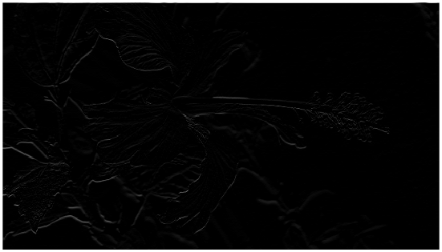
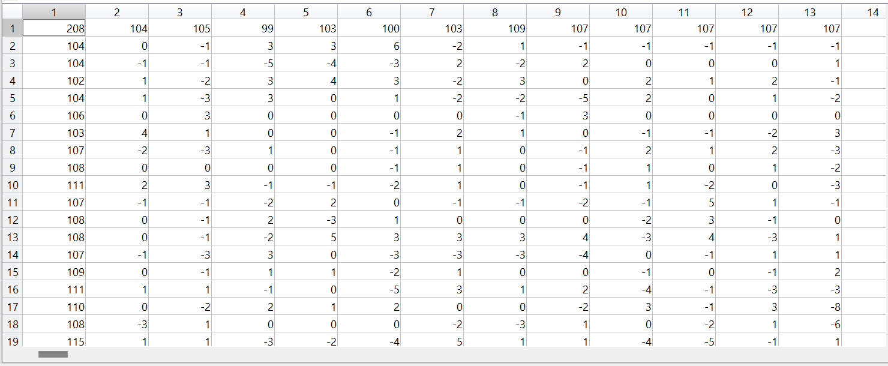

---

# Edge finding Filter examples

## All edges 
filter = [-1 -1 -1; -1 8 -1; -1 -1 -1]
<table>
  <tr>
    <td></td>
    <td></td>
  </tr>
</table>

Now we compare other edges with these

## 1st order derivative

### Horizontal lines
filter = [-1;1]
<table>
  <tr>
    <td></td>
    <td></td>
  </tr>
</table>

### Vertical lines
filter = [-1 1]
<table>
  <tr>
    <td></td>
    <td></td>
  </tr>
</table>

## 2nd order derivative

### Horizontal lines
filter = [1;-2;1]
<table>
  <tr>
    <td></td>
    <td></td>
  </tr>
</table>

### Vertical lines
filter = [1 -2 1]
<table>
  <tr>
    <td></td>
    <td></td>
  </tr>
</table>

## Comparison between 1st & 2nd order
### Horizontal lines
<table>
  <tr>
    <td></td>
    <td></td>
  </tr>
</table>

### Vertical lines
<table>
  <tr>
    <td></td>
    <td></td>
  </tr>
</table>

## Laplacian filters 

### Horizontal and vertical lines
filter = [0 1 0; 1 -4 1; 0 1 0]
<table>
  <tr>
    <td></td>
    <td></td>
  </tr>
</table>

### Diagonal lines
filter = [-1 0 -1; 0 4 0; -1 0 -1]
<table>
  <tr>
    <td></td>
    <td></td>
  </tr>
</table>

## Comparison of center weight +ve & -ve
<table>
  <tr>
    <td></td>
    <td></td>
  </tr>
</table>

---
