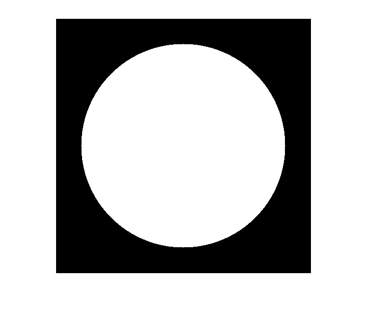

---

# Circle Drawing Algorithm

This folder contains two files: `circle.m` and `output.jpg`.

## Output

The output of the `circle.m` script is saved as `output.jpg`. You can view the generated image below:

---
