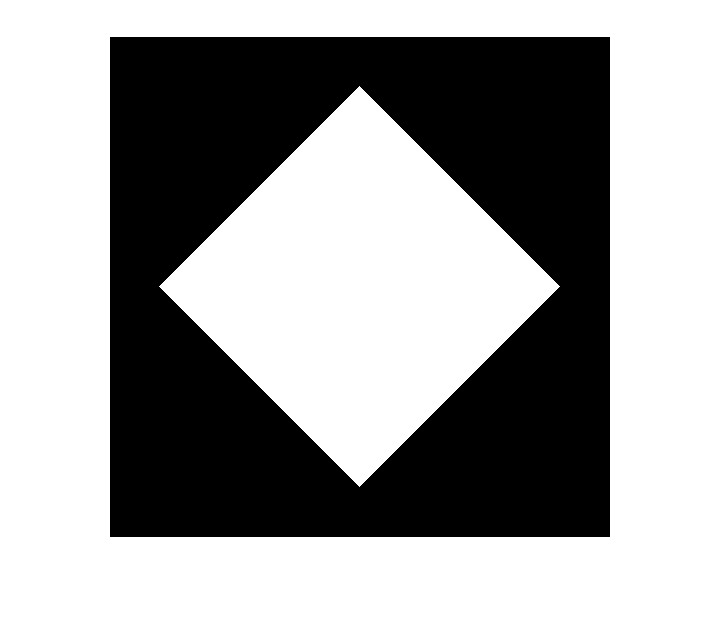
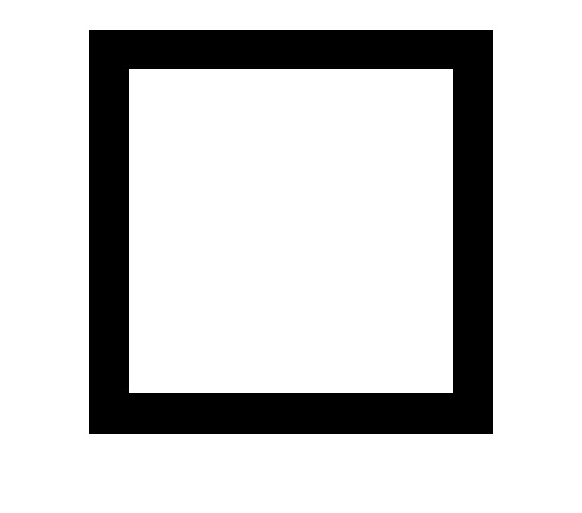
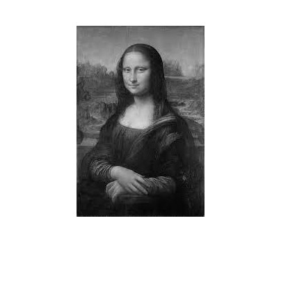
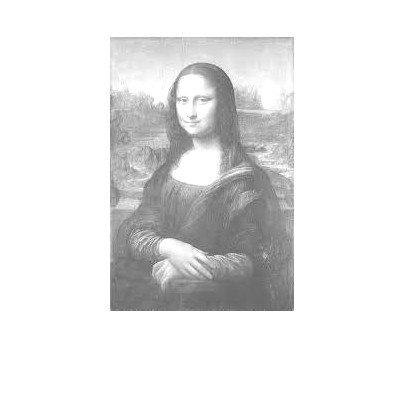
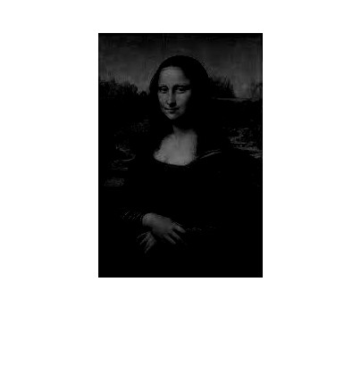
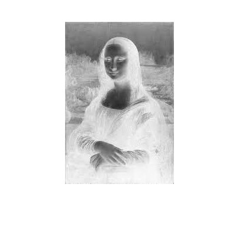

---

# Diamond & Square Drawing Algorithm

## Output1

The output of the `Diamond.m` script is saved as `diamond.jpg`. You can view the generated image below:

## Output2

The output of the `square.m` script is saved as `square.jpg`. You can view the generated image below:

---

---

# Pixel Opertions

## Output1

B(i,j) = img(i,j) + 100;

<table>
  <tr>
    <td></td>
    <td></td>
  </tr>
</table>

## Output2

B(i,j) = img(i,j) - 100;

<table>
  <tr>
    <td></td>
    <td></td>
  </tr>
</table>

## Output3

Negative Image
B(i,j) = 255 - img(i,j);

<table>
  <tr>
    <td></td>
    <td></td>
  </tr>
</table>
---