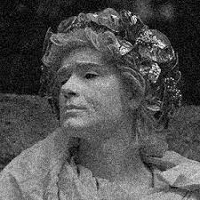
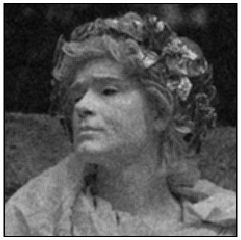

---

# Smoothing/Averaging/Noice reduction 

This folder contains two files: `Smoothing_3x3` and `Generic_Code.m`.
In `Smoothing_3x3` we design simple 3x3 filter, and in `Generic_Code.m` we try to make generic code so any filter can apply

## Output

The output of the `Smoothing_3x3` 

<table>
  <tr>
    <td></td>
    <td></td>
  </tr>
</table>

---

## Output

The output of the `Generic_Code` 

<table>
  <tr>
    <td></td>
    <td></td>
  </tr>
</table>

---
