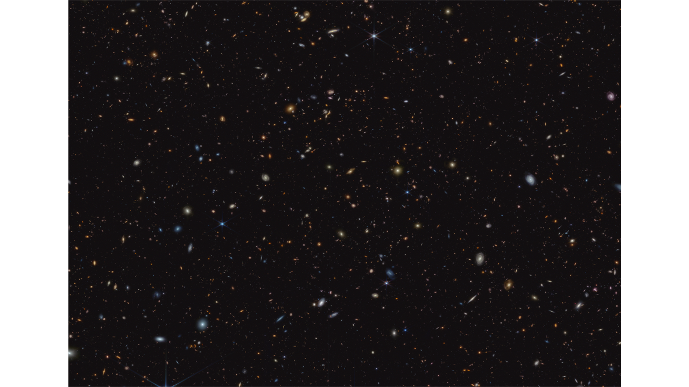
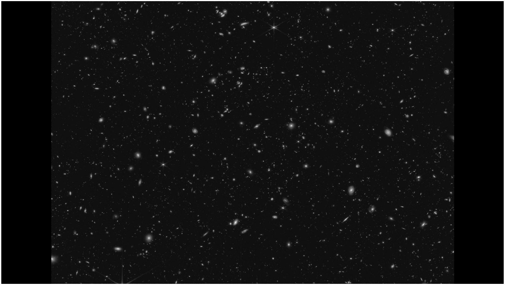
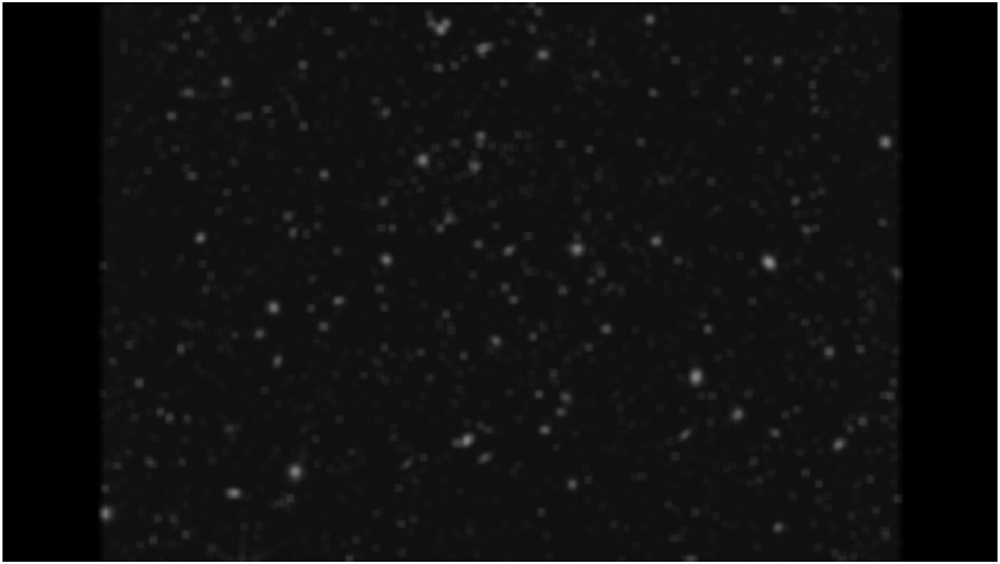
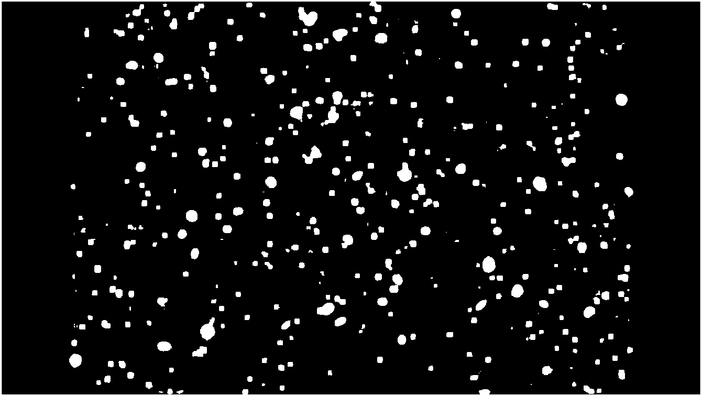
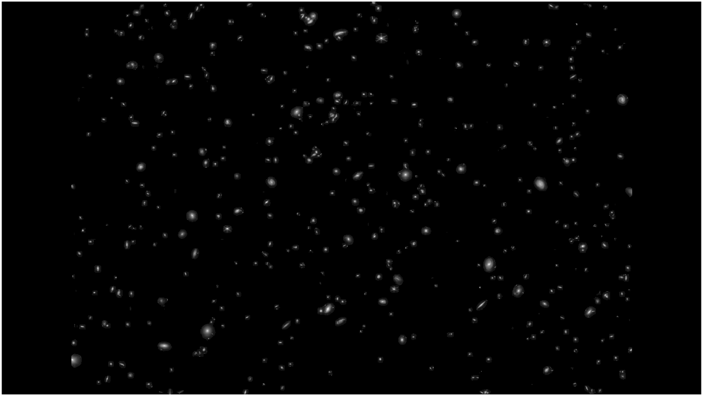
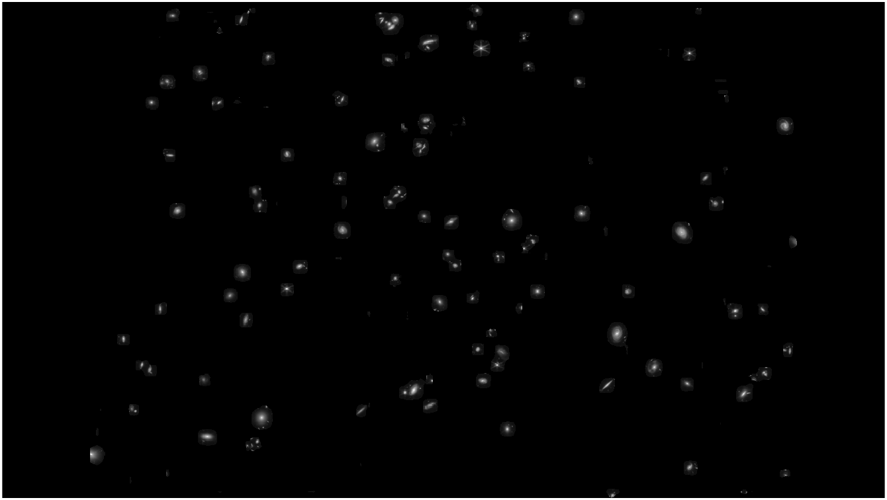
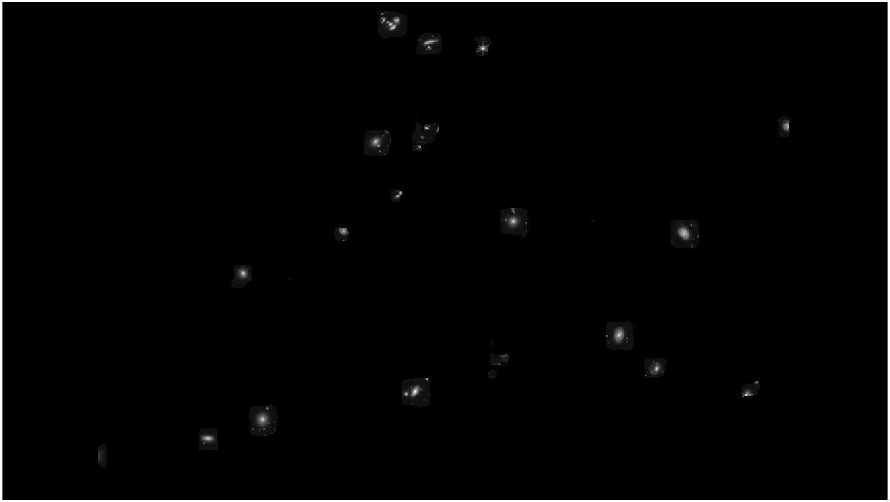

---

# Find Large stars in Image

## Actual image

## Step 1: GrayScale Image

## Step 2: Blur Image
To blur or remove small stars

## Step 3: Binary Image
Do binarization or segmentation

## Step 4: Final Image
Apply binary img as mask on grayscale img

## Output 20x20 filter
Just change filter size in code

## Output 40x40 filter
Just change filter size in code

## Side by Side Comparisons

### 10x10

<table>
  <tr>
    <td></td>
    <td></td>
  </tr>
</table>

### 20x20

<table>
  <tr>
    <td></td>
    <td></td>
  </tr>
</table>

<table>
  <tr>
    <td></td>
    <td></td>
  </tr>
</table>
---
