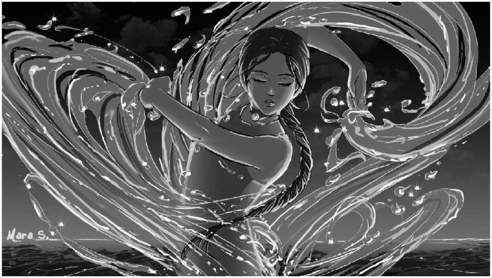

---

# Statistical Operations

### Min filter

<table>
  <tr>
    <td></td>
    <td></td>
  </tr>
</table>

### Max filter

<table>
  <tr>
    <td></td>
    <td></td>
  </tr>
</table>

### Median filter

<table>
  <tr>
    <td></td>
    <td></td>
  </tr>
</table>

# Sharpening Filter

### Edge detection [-1 -1 -1; -1 8 -1;-1 -1 -1]

<table>
  <tr>
    <td></td>
    <td></td>
  </tr>
</table>

# Sharpening through Averaging Filter

## Step 1: GrayScale Image

## Step 2: Blur Image

## Step 3: Find Edges
these can be get by : img - blur_img

## Step 4: Sharp image
this can be get by : img + edges

## Side by Side Comparisons

<table>
  <tr>
    <td></td>
    <td></td>
  </tr>
</table>

---
